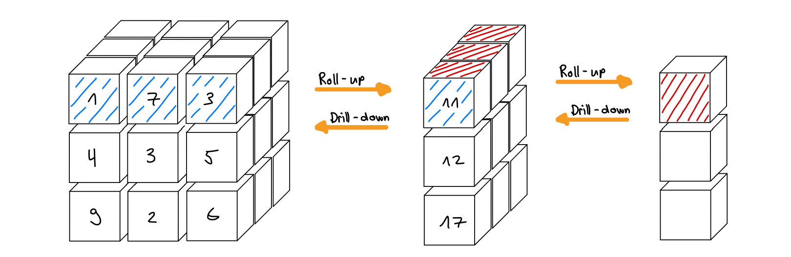
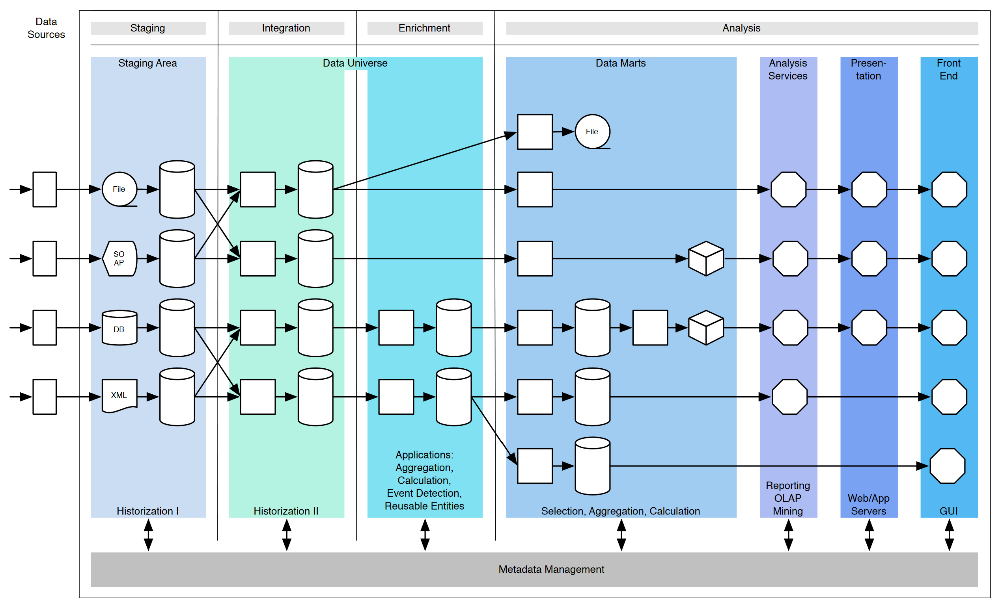

# Structured Data

## Save Data

| Flat Files                                   | Relational Systems            |
| -------------------------------------------- | ----------------------------- |
| easy to read, write, analyze                 | well defined structure        |
| no optimsed access                           | well structured and organized |
| inconsistent, concurrent, integrity problems | metadata in form of schema    |
|                                              | multiple users simultaneously |
|                                              | good Query processing         |

## OLTP vs OLAP

!!! info

    OLTP - Online Transaction Processing

    OLAP - Online Analytical Processing

### OLTP

| Advantages        | Usage             |
| ----------------- | ----------------- |
| Many small writes | Ecommerce         |
| Real time         | Booking Systems   |
| Fast              | Bank Transactions |
| Efficient         | Consumer Goods    |

### OLAP

| Advantages                        | Usage                       |
| --------------------------------- | --------------------------- |
| Analysis of large Amounts of Data | Complex Business Questions  |
| Different Data Sources            | BI Systems                  |
| Aggregations                      | Data Warehouse Environments |
| Multidimensional Data             |                             |

### Comparision

| OLTP                                      | OLAP                                  |
| ----------------------------------------- | ------------------------------------- |
| Includes Day to Day Transactions          | Includes historical Transactions      |
| OLTP is used by DB Professionals          | OLAP is used by Managers and Analysts |
| To keep running the business              | to analyze the business               |
| Focus on Data                             | Focus on Information                  |
| ER Diagram                                | Star/Snowflake Schema                 |
| Highly detailed with flat relational Data | Aggregated, Multidimensional Data     |
| Around 1000 Users                         | Around 100 Users                      |
| Amount of Record access: 10               | Amount of Record access: 1 Mio        |
| DB Size: 100MB - 100GB                    | DB Size: 100GB - 100TB                |

## OLAP Operations

!!! info

    Operations to transform & analyze multidimensional Data Cubes

### Pivoting / Rotation

!!! info

    Cube rotation at Dimensions change, analysis from different perspectives. Perspectives

### Roll-up / Drill-down

!!! info

    **Roll-up** - Aggregation of detailed Data (Dimension Reduction)

    **Drill-down** - Breakdown of aggregated Data (Dimension Enlargement)

### Slice / Dice

!!! info

    **Slice** - Selection of one or more Dimensions

    **Dice** - Selection of one or more Dimensions and one or more Members

## Data Warehouse

!!! info

    Repository of integrated Data which manages multiple Data Sources

{ loading=lazy }

**Characteristics of a Data Warehouse**

-   Collection of Data to support Management's Decision Making Process
-   Subject oriented (Product, Customer, Sales, Revenue, etc.)
-   Integrated (from heterogeneous Data Sources)
-   Time Variant (historical Point of View)
-   Non-volatile (Data is never removed when new Data is added)
-   Data Warehouse is seperate from Operational Database

**Types of Data Warehouses**

-   Information Processing

    -   Data Processing in Data Warehouse
    -   Simple Statistics

-   Analytical Processing

    -   Supports analytical Processing
    -   Slice & Dice, Drill-down, Roll-up, etc.

-   Data Mining
    -   hidden Patterns, unknown Correlations, etc.
    -   Classification, Prediction, etc.

## Data Lake

!!! info

    Collection of many Data and Data Sources (structured, unstructured, semi-structured)

| Data Warehouse                                                                                                          | Data Lake                                                                       |
| ----------------------------------------------------------------------------------------------------------------------- | ------------------------------------------------------------------------------- |
| Stores **structured Data** that has been extracted, transformed and loaded from various Sources                         | Stores **raw, unstructured or semi-structured Data** from various Sources       |
| Data is stored in a **predefined Schema** with a Structure                                                              | Data is stored in its **native Format** without a predefined Schema/Structure   |
| Designed for **complex Queries** and **generating Reports**                                                             | Designed for **storing** and **processing** large volumes of Data               |
| Provides a centralized/organized approach to Data Storage                                                               | Provides a flexible/scalable approach to Data Storage                           |
| **Data Processing** is performed before **Data Load into Warehouse**, can be **time-consuming and ressource-intensive** | **Data Processing** is performed **on an as-needed basis**, more agile/scalable |
| Optimized for **BI** and **Analytics**                                                                                  | Optimized for **Data Exploration**, **Machine Learning** and advanced Analytics |
| Data is already cleaned and processed                                                                                   | Requires additional processing and cleaning                                     |
| **Schema on Write**                                                                                                     | **Schema on Read**                                                              |
| Higher cost of storage                                                                                                  | Lower cost of storage                                                           |

## Data Mart

!!! info

    Subset of Data Warehouse, optimized for specific Domain Operations: optimized Data Model (special Views, Data Subsets, etc.)

## Extract, Transform, Load (ETL)

Process of extracting Data from Source Systems and bringing it into Data Warehouse

### Extract

**Batch Processing**

-   Creates batches of defined size/time interval
-   Needs space for buffering

**Real-Time Processing**

-   Processes Data Item by Item continuously
-   Each Item is only processed once

**Synchron Notification**

-   Source pushes each Data update to Data Warehouse

**Asynchron Notification**

-   Periodic
    -   Source generates Extracts on regular Basis
    -   Data Warehouse prompts for updates on regular Basis
-   Event-Driven
    -   Data Warehouse prompts for updates (e.g. end of Month)
-   Query-Driven
    -   Data Warehouse prompts for updates before each new Data access

**Type of Data**

-   Snapshots (Source delivers complete Data Set each Time)
-   Logs (Source delivers each update Operation)
-   Netlogs (Source delivers Net Updates)

### Transform

### Load

### ETL vs ELT

## Profiling

## Data Cleansing

### Nan Values

## Schemas

### Star Schema

### Snowflake Schema
