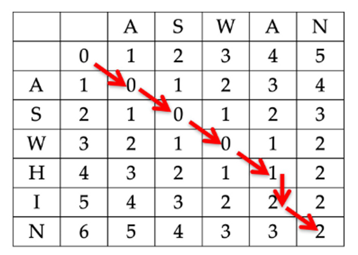

# Unstructured Data for Information Retrieval

**Elements of information retrieval:**

-   Information Needs (User Query)
-   Information Resources (Documents)
-   System that identifies Sources and indicates relevance

## Text Representations in IR

### Unstructured Representation

-   Standart text representation
-   Bag of words: unordered set of terms
-   Good performance but not always relevant results

**Example:**

> “One evening Frodo and Sam were walking together in the
> cool twilight. Both of them felt restless again. On Frodo
> suddenly the shadow of parting had falling: the time to leave
> Lothlorien was near.”

```json
{
    "one": 1,
    "evening": 1,
    "frodo": 2,
    ...
}
```

### Weakly-Structured Representation

-   Some group of terms which are more important (e.g. Nouns, named entities)
-   Other Terms: ignored or down-scaled
-   Needs preprocessing: NLP (e.g. POS tagging: part-of-speech tagging to identify nouns)

**Example:**

> “One evening Frodo and Sam were walking together in the
> cool twilight. Both of them felt restless again. On Frodo
> suddenly the shadow of parting had falling: the time to leave
> Lothlorien was near.”

```json
// Count of Nouns
{
    "evening": 1,
    "frodo": 2,
    "sam": 1,
    "twilight": 1,
    "shadow": 1,
    "lothlorien": 1
}

// Count of Names in Nouns
{
    "frodo": 2,
    "sam": 1,
}
```

### Structured Representation

-   Graph with nodes and edges
-   Describes relations between terms

**Example:**

> “One evening Frodo and Sam were walking together in the
> cool twilight. Both of them felt restless again. On Frodo
> suddenly the shadow of parting had falling: the time to leave
> Lothlorien was near.”


## Text Preprocessing

!!! note

    Goal: Reduce Vocabulary Size: remove noise

-   How to split words?
-   Remove filler words
-   Handle differend verb forms, adjectives and nouns with the same stem
-   Handle synonyms and similar concepts in other languages
-   Different document types needs different preprocessing

### Procedure

1. Extract plain text from document (e.g. `.txt`, `.pdf`, `.docx`, `.html`)
2. Language detection
3. Tokenization (split text to character sequences)
4. Morphological Normalization (e.g. stemming, lemmatization)
5. Stopwords Removal
6. Indexing

## Tokens and Terms

|                  |                                       |
| ---------------- | ------------------------------------- |
| **word**         | string with characters                |
| **term**         | normalized form of word               |
| **token**        | instance of term in text              |
| **tokenization** | process of splitting text into tokens |

### Tokenization/Normlization

**Methods:**

-   Rule-based
-   Supervised learning

#### Procedure Normalization [^1]

-   Error/Spelling correction
-   Case folding: all characters to lowercase
-   Morphological normalization: reducing different forms of the same word to a common word
-   Inflectional normalization / Lemmatization: normalization of same words to the lexically correct base form
-   Derivational normalization: normalization of word to the lexically correct base form (specialized)
-   Stemming: normalization of word stem (e.g. "automates", "automated", "automatic" to "automat")
    -   Porter Stemmer (algorithm which cuts off certain suffixes) [^2]

### Expanding Queries

Theoretically very powerful but in practice inefficient because of indexing similar words.

### Stopword Removal [^3] [^4]

-   Stopwords: words which are very common and not relevant for IR
-   Reduces vocabulary size
-   Low significance
-   Can match false positives

## Boolean Retrieval

!!! note

    Method for matching documents against queries with boolean operators (AND, OR, NOT)

-   Inefficient because of large text, ignores spacing to words in sentence

**Models:**

-   Boolean Model (True/False)
-   Algebraic Model (Vector Space Model)
-   Probabilistic Model (Binary Independence Model)
-   Semantic Model

### Components

-   **Query Text:** representation of raw query
-   **Documents:** representation of raw documents
-   **Function:** maps relevant documents for query:
    -   `fd` maps document to representation (IR standard)
    -   `fq` maps query to representation (IR standard)
    -   `r` Ranking: calculates relevance of document for query

### Therm Document / Incidence Matrix

-   Good for small collections
-   Dictionary: all terms in collections
-   Vector: count of terms in document

**Example:**

Document:

> One evening Frodo and Sam were walking together in the cool twilight.

Dimension:

```json
{
    "one": 1,
    "evening": 1,
    "frodo": 1,
    "sam": 1,
    "walking": 1,
    "together": 1,
    "cool": 1,
    "twilight": 1,
    "restless": 0,
    "shadow": 0
}
```

Vector:

```json
[1, 1, 1, 1, 1, 1, 1, 1, 0, 0]
```

### Inverted Index

-   Good for efficient handling
-   Contains word and list of documents where word occurs

**Example:**

Document 1:

> One evening Frodo and Sam were walking together in the cool twilight.

Document 2:

> Both of them felt restless again.

Dimension:

```json
{
    "one": [1],
    "evening": [1],
    "frodo": [1],
    "sam": [1],
    "walking": [1],
    "together": [1],
    "cool": [1],
    "twilight": [1],
    "restless": [2]
}
```

Query `Sam AND Frodo`:

```json
sam = [1]
frodo = [1]
sam ∩ frodo = [1]
```

#### Intersection Optimization

-   Intersection from small list to large list
-   Sort index alphabetically
-   Add Skip Pointers (Step size: $\sqrt(N)$)


## Ranked Retrieval

!!! note

    Boolean retrieval returns only True/False for query. Ranked retrieval returns a ranking for each document.

### Ranking Principle 1

!!! note

    Relevance bei amount of unique query terms in document (count of unique query terms)

**Example Query:** `earthquake epicentre richter scale`

Document 1:

> Yesterday there was an **earthquake** in China. The **epicentre** was 200 miles north of the capitol.
> The measurement on the **richter scale** was about ...

Document 2:

> After the strong **earhquake** in 2020, the damages has been repaired really fast.
> The beautiful city Bolognese in Italy with its new mayor Andrea **Richter** currently experiences ...

### Ranking Principle 2

!!! note

    Relevance by total amount of query terms in document (count of all query terms)

**Example Query:** `earthquake richter`

Document 1:

> Yesterday there was an **earthquake** in China. The epicentre was 200 miles north of the capitol.
> The measurement on the **richter scale** was about 5.7. The duration of the **earthquake** was about 30 seconds.

Document 2:

> After the strong **earhquake** in 2020, the damages has been repaired really fast.
> The beautiful city Bolognese in Italy with its new mayor Andrea **Richter** currently experiences ...

### Ranking Principle 3

!!! note

    Relevance by rarity of occurence of query terms in document (focus: min. all query terms)

**Example Query:** `earthquake bolognese`

Document 1:

> Yesterday there was an **earthquake** in China. The epicentre was 200 miles north of the capitol.
> The measurement on the **richter scale** was about 5.7. The duration of the **earthquake** was about 30 seconds.

Document 2:

> After the strong **earhquake** in 2020, the damages has been repaired really fast.
> The beautiful city **Bolognese** in Italy with its new mayor Andrea Richter currently experiences ...

### Ranking Principle 4

!!! note

    Relevance by distance of query terms to each other in document (how close are the query terms)

**Example Query:** `Hans Meyer`

Document 1:

> **Hans Meyer** elected as new president. Yesterday, **Hans Meyer** was elected as new president of ...

Document 2:

> **Hans** Gfeller, Horst Peter, Markus **Meyer**

### Ranking Principle 5

!!! note

    Relevance by position of query terms in document (how early are the query terms in the document)

**Example Query:** `Hans Meyer`

Document 1:

> **Hans Meyer** elected as new president. Yesterday, **Hans Meyer** was elected as new president of ...

Document 2:

> After the election of a new president, a lot of thins are updated. According to **Hans Meyer** there will be ...

### Modified Ranking Index

#### Ranking (R1, R2, R3)

-   R1: Relevance by amount of unique query terms in document
-   R2: Relevance by total amount of query terms in document
-   R3: Relevance by rarity of occurence of query terms in document

**Schema:**

```json
{
    "value": [[Document Nr., Amount of Occurences], ...],
    "example": [[1, 4], [2, 3]]
}
```

#### Ranking (R1, R2, R3, R4, R5)

-   R1: Relevance by amount of unique query terms in document
-   R2: Relevance by total amount of query terms in document
-   R3: Relevance by rarity of occurence of query terms in document
-   R4: Relevance by distance of query terms to each other in document
-   R5: Relevance by position of query terms in document

**Schema:**

```json
{
    "value": [[Document Nr., Amount of Occurences, [Position 1, Position 2, ...]], ...],
    "example": [[1, 4, [1, 2, 3, 4]], [2, 3, [1, 2, 3]]]
}

```

## Vector Space Model

!!! note

    Model for representing documents and queries as vectors in a multidimensional space. Similarity between documents is measured by the angle.

**Cosiine Similarity:**

$$
\cos(\theta) = \frac{A \cdot B}{\|A\| \|B\|} = \frac{\sum_{i=1}^{n} A_i B_i}{\sqrt{\sum_{i=1}^{n} A_i^2} \sqrt{\sum_{i=1}^{n} B_i^2}}
$$

**Example:**

| Document 1:                                               | Document 2:                         |
| --------------------------------------------------------- | ----------------------------------- |
| Frodo and Sam were walking together in the cool twilight. | Frodo likes to walk in the evening. |

Dimension:

```json
["frodo", "sam", "walk", "together", "cool", "twilight", "like", "evening"]
```

Vectors:

```json
D1 = [1, 1, 1, 1, 1, 1, 0, 0]
D2 = [1, 0, 1, 0, 0, 0, 1, 1]
```

Query: `sam twilight`

```json
q = [0, 1, 0, 0, 0, 1, 0, 0]
```

Result:

```json
cos(D1, q) = 0.5
cos(D2, q) = 0
```

### Term Frequency (TF)

!!! note

    Weighted term frequency in a document

$$
tf_{t,d} = \frac{\text{count of term t in document d}}{\text{total count of terms in document d}}
$$

**Example:**

Document 1:

> One evening Frodo and Sam were walking together in the cool twilight.
> Both of them felt restless again. On Frodo suddenly the shadow of parting had falling:
> the time to leave Lothlorien was near. **Total count: 34**

| Term  | Count | Term Frequency                            |
| ----- | ----- | ----------------------------------------- |
| Frodo | 2     | $tf(\text{Frodo}, d_1) = 2 / 34 = 0.0588$ |
| Sam   | 1     | $tf(\text{Sam}, d_1) = 1 / 34 = 0.0294$   |

### Inverse Document Frequency (IDF)

!!! note

    Importance of a term in all documents. High if term occurs in few documents.

$$
idf_{t} = \log \frac{\text{total count of documents}}{\text{count of documents with term t}}
$$

**Example:**

Document 1:

> One evening Frodo and Sam were walking together in the cool twilight.

Document 2:

> Both of them felt restless again.

Document 3:

> On Frodo suddenly the shadow of parting had falling: the time to leave Lothlorien was near.

| Term  | Count | Inverse Document Frequency  |
| ----- | ----- | --------------------------- |
| Frodo | 2     | $\log(\frac{3}{2}) = 0.176$ |
| Sam   | 1     | $\log(\frac{3}{1}) = 0.477$ |

### TF-IDF

!!! note

    Weighted term frequency in a document with importance of a term in all documents.

**High Value:** Term occurs often in a document and rarely in other documents

$$
tfidf_{t,d} = tf_{t,d} \cdot idf_{t}
$$

**Example:**

Document 1:

> One evening Frodo and Sam were walking together in the cool twilight.

Document 2:

> Both of them felt restless again.

Document 3:

> On Frodo suddenly the shadow of parting had falling: the time to leave Lothlorien was near.

| Term  | TF                | IDF                         | TF-IDF |
| ----- | ----------------- | --------------------------- | ------ |
| Frodo | $2 / 34 = 0.0588$ | $\log(\frac{3}{2}) = 0.176$ | 0.0006 |
| Sam   | $1 / 34 = 0.0294$ | $\log(\frac{3}{1}) = 0.477$ | 0.0140 |

## Data Processing / Record Linkage

**Synonyms:** Entity Resolution, Duplicate Detection, Coreference Resolution, Fuzzy Matching

### Data Integration

> Providing data that exists in several autonomous data resources

## Record Linkage

!!! note

    Record linkage identifies records of the same entity by comparing identifiers and avoids duplicates.
    It is often used in data integration and marketing.

### Levenshtein Distance

!!! note

    Distance between two strings (e.g. words) by counting the minimum number of operations to transform one string to another.

**Costs:**

{width=50%; align=left}

| Operation         | Cost |
| ----------------- | ---- |
| Copy Character    | 0    |
| Insert Character  | 1    |
| Delete Character  | 1    |
| Replace Character | 1    |

<br/>

**Procedure:**


**Path:** Backwards, smallest cost first than diagonal backwards

[^1]: [https://pypi.org/project/compound-split/](https://pypi.org/project/compound-split/){target="\_blank"}
[^2]: [https://snowball.tartarus.org/algorithms/porter/stemmer.html](https://snowball.tartarus.org/algorithms/porter/stemmer.html){target="\_blank"}
[^3]: [https://www.ranks.nl/stopwords](https://www.ranks.nl/stopwords){target="\_blank"}
[^4]: [https://www.nltk.org/](https://www.nltk.org/){target="\_blank"}
