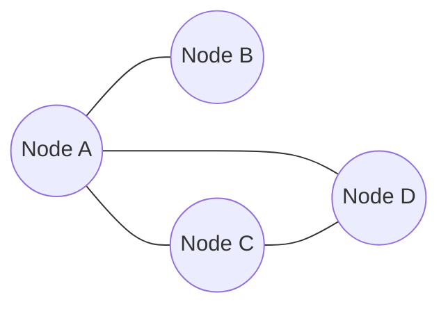
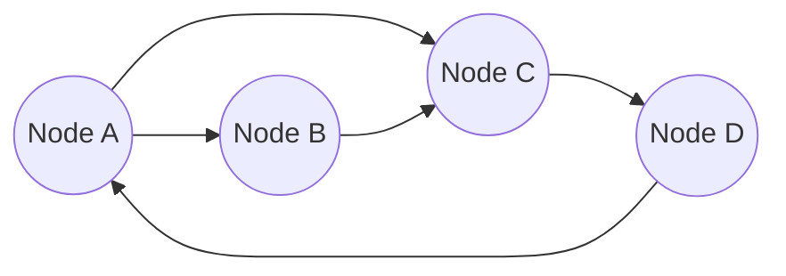
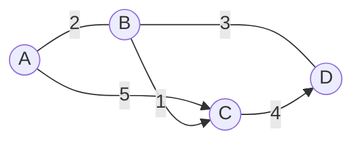
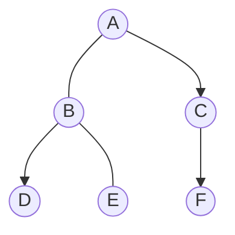

# Graphs

Graphs are a data structures which represent a set of nodes and edges connecting them. They are used to represent relationships between objects. Graphs are used in many fields, such as social networks, transportation networks, and computer networks.

## Undirected Graphs

Undirected graphs are graphs where the edges do not have a direction. This means that if there is an edge between two nodes, then there is also an edge between those nodes in the opposite direction.

## Directed Graphs

Directed graphs are graphs where the edges have a direction. This means that if there is an edge between two nodes, then there is not necessarily an edge between those nodes in the opposite direction.

## Weighted Graphs

Weighted graphs are graphs where the edges have a weight. This means that each edge has a value associated with it. This value can be used to represent the cost of traversing the edge.

## Binary Trees

Binary trees are a type of tree where each node has at most two children. These children are referred to as the left child and the right child.

