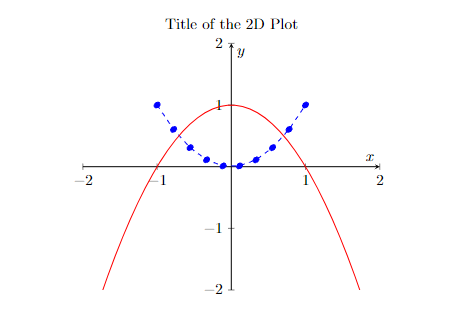
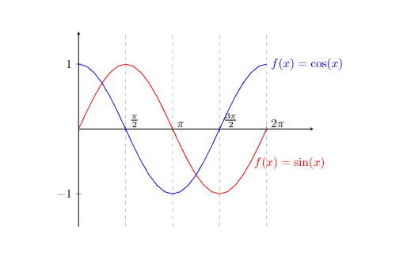
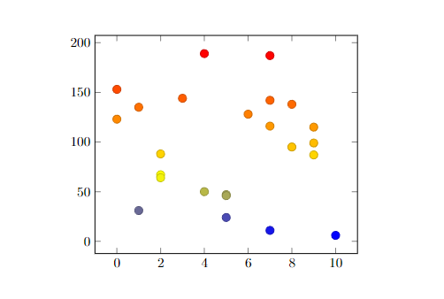
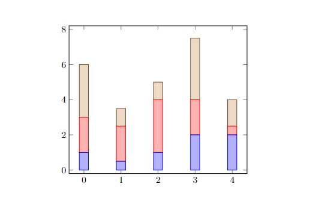
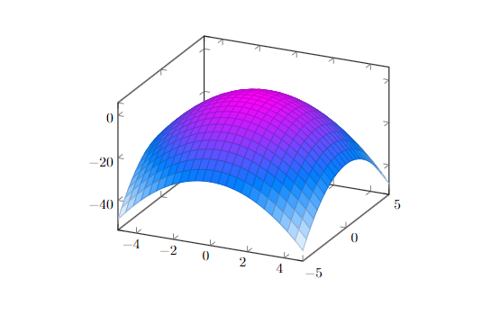
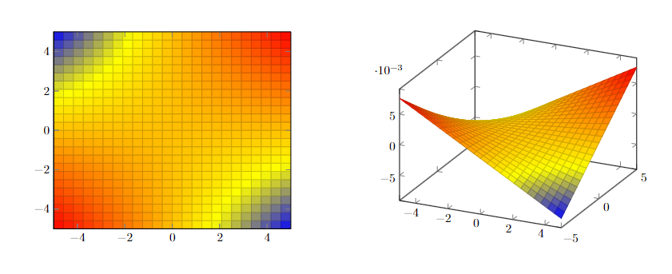

# LaTeX Plots

Ressources:

-   [PGFPlots](https://pgfplots.sourceforge.net/){target=\_blank}

```latex
\usepackage{pgfplots}
\pgfplotsset{compat=1.18}
```

## 2D Plots

```latex
\begin{tikzpicture}
    \begin{axis}[xmin=-2, xmax=2, ymin=-2, ymax=2, axis lines=middle,
            xlabel=$x$, ylabel=$y$, title={Title of the 2D Plot}]
        \addplot[blue, dashed, mark=*, samples=10, domain=-1:1]{x^2};
        \addplot[red, samples=100]{1-x^2};
    \end{axis}
\end{tikzpicture}
```

{loading=lazy}

### Advanced Line Plot

```latex
\begin{tikzpicture}
    \begin{axis}[clip=false,
        xmin=0,
        xmax=2.5*pi,
        ymin=-1.5,
        ymax=1.5,
        axis lines=middle,
        xtick={0, 0.5*pi, pi, 1.5*pi, 2*pi},
        xticklabels={$0$, $\frac{\pi}{2}$, $\pi$, $\frac{3\pi}{2}$, $2\pi$},
        xticklabel style={anchor=south west},
        xmajorgrids=true, grid style=dashed]
        \addplot[domain=0:2*pi, red]{sin(deg(x))}
        node[right, pos=0.9]{$f(x)=\sin (x)$};
        \addplot[domain=0:2*pi, blue]{cos(deg(x))}
        node[right, pos=1]{$f(x)=\cos (x)$};
    \end{axis}
\end{tikzpicture}
```

{loading=lazy}

### Scatter Plot

```latex
\begin{tikzpicture}
    \begin{axis}[]
        \addplot+[
            only marks,
            scatter,
            mark size=3pt]
            % for .txt:
            % table[meta=y]
            %{data.txt};
            coordinates {
                (2,67) (7,11) (4,189) (3,144) (5,24) (8,95)
                (5,47) (9,99) (10,6) (2,88) (8,138) (1,31)
                (9,115) (7,142) (7,187) (0,153) (2,64) (9,87)
                (7,116) (4,50) (0,123) (6,128) (1,135) (5,46)
            };
    \end{axis}
\end{tikzpicture}
```

{loading=lazy}

### Stacked Bar Plot

```latex
\begin{tikzpicture}
    \begin{axis}[ybar stacked]
        \addplot coordinates {(0,1) (1,0.5) (2,1) (3,2) (4,2)};
        \addplot coordinates {(0,2) (1,2) (2,3) (3,2) (4,0.5)};
        \addplot coordinates {(0,3) (1,1) (2,1) (3,3.5) (4,1.5)};
    \end{axis}
\end{tikzpicture}
```

{loading=lazy}

## 3D Plots

```latex
\begin{tikzpicture}
    \begin{axis}[colormap/cool]
        %remove grey lines with shader=interpr
        % only gridlines replace surf with mesh
        \addplot3[surf]{1-x^2-y^2};
    \end{axis}
\end{tikzpicture}
```

{loading=lazy}

### Niveau Plot

=== "Niveau Plot"

    ```latex
    \begin{tikzpicture}
        \begin{axis}[view={0}{90}]
            \addplot3[surf]{sin(x) * sin(y)};
        \end{axis}
    \end{tikzpicture}
    ```

=== "3D Plot"

    ```latex
    \begin{tikzpicture}
        \begin{axis}[]
            \addplot3[surf]{sin(x) * sin(y)};
        \end{axis}
    \end{tikzpicture}
    ```

{loading=lazy}
