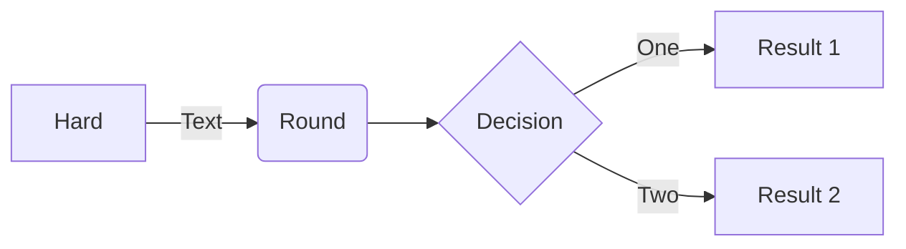

# MkDocs Material :simple-markdown:

Is a theme for MkDocs that provides a clean and responsive design. It is based on the Material Design guidelines by Google. MkDocs is a static site generator that is geared towards building project documentation. It is written in Python and uses Markdown to create pages.

!!! note "Info"

    - [MkDocs Material Setup](https://squidfunk.github.io/mkdocs-material/setup/changing-the-colors/){target=\_blank}
    - [MkDocs Material Reference](https://squidfunk.github.io/mkdocs-material/reference/){target=\_blank}

    Are pretty good resources for learning how to use MkDocs and MkDocs Material.

## Admonitions

```markdown
!!! tip "Title"

    Some content
```

!!! tip "Title"

    Some content

### Available Tags

| Tag        |          Icon           | Description              |
| ---------- | :---------------------: | ------------------------ |
| `note`     |    :octicons-tag-16:    | General note             |
| `abstract` | :octicons-checklist-16: | Summary of content       |
| `info`     |   :octicons-info-16:    | Informational note       |
| `tip`      | :octicons-squirrel-16:  | Helpful tip              |
| `success`  |   :octicons-check-16:   | Successful operation     |
| `question` | :octicons-question-16:  | Question                 |
| `warning`  |   :octicons-alert-16:   | Warning                  |
| `failure`  | :octicons-x-circle-16:  | Failed operation         |
| `danger`   |    :octicons-zap-16:    | Danger                   |
| `bug`      |    :octicons-bug-16:    | Bug notice               |
| `example`  |  :octicons-beaker-16:   | Example for illustration |
| `quote`    |   :octicons-quote-16:   | Quote                    |

## Code Blocks

````markdown
```bash title="bash"
echo "Hello World"
```
````

```bash title="bash"
echo "Hello World"
```

### Multi Tabbed Code Blocks

````markdown
=== 'python'

    ```python
    print("Hello World")
    ```

=== 'javascript'

    ```javascript
    console.log("Hello World")
    ```
````

=== "Python"

    ```python
    print("Hello World")
    ```

=== "JS"

    ```javascript
    console.log("Hello World")
    ```

## Mermaid

````markdown

````


## Math

```markdown
$$
\operatorname{ker} f=\{g\in G:f(g)=e_{H}\}{\mbox{.}}
$$
```

$$
\operatorname{ker} f=\{g\in G:f(g)=e_{H}\}{\mbox{.}}
$$
