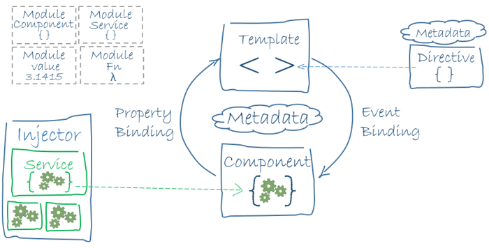

---
hide:
    - toc
---

# Angular

Angular[^1] is a framework for building client applications in HTML, CSS and TypeScript.

It works with:

-   Modules
-   Components (with templates)
-   Injectors/Services

## Concept

Angular Concept of Modules, Components and Injectors[^2]

[^1]: [Angular](https://angular.io/)
[^2]: [Angular Concept](https://angular.io/guide/architecture)
